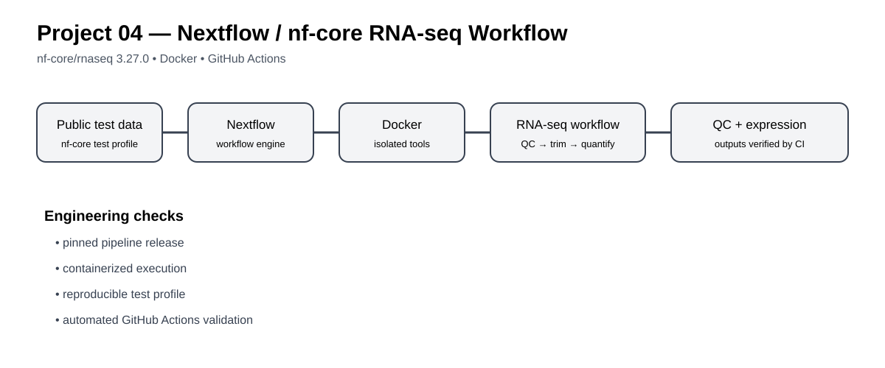
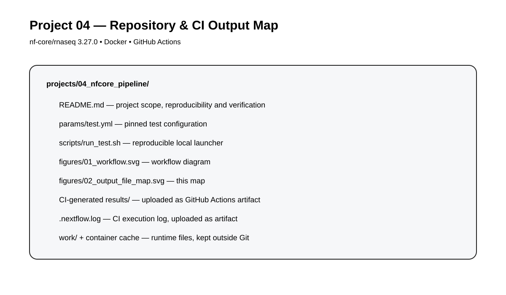

# Project 04 — Production-style Nextflow / nf-core RNA-seq Pipeline

A workflow-engineering project focused on reproducibility, containerization, parameterization, resource awareness and automated validation using Nextflow and nf-core.

## Objective

Validate a complete RNA-seq workflow reproducibly in Docker using the maintained nf-core/rnaseq test profile and GitHub Actions.

This project is intentionally different from Project 06: Project 04 focuses on workflow engineering and execution reliability; Project 06 will focus on biological transcriptomics analysis and differential expression.

## Workflow figure

## Workflow

nf-core/rnaseq test data → Nextflow → Docker containers → QC → trimming → strandedness inference → alignment / quantification → expression outputs + QC reports → GitHub Actions validation

## Reproducibility target

- nf-core/rnaseq: 3.27.0
- Execution engine: Nextflow 26.04.6 in CI
- Container runtime: Docker
- Validation: GitHub Actions
- Test profile: test,docker
- Output directory: results

## CI verification

**Status: 🟢 Completed**

GitHub Actions run #2 completed successfully on 2026-10-06.

- Workflow run: 37505789353
- Commit: ce80a170070b3fda3ce377dea07b4aae443e3488
- Job: nfcore-test
- Job conclusion: success
- nf-core/rnaseq test step: success
- Output artifact: project04-nfcore-results
- Artifact size: 50,007,842 bytes
- Artifact SHA-256: 343073a039e4408d5f710e30592294c1c6c30b9faa84881dfb0e94668da1855d
- Artifact contains the CI results/ output and .nextflow.log.

The first CI attempt failed during parameter validation because outdir was required. The workflow was corrected to pass --outdir results, then the complete nf-core test succeeded.

## Output map

## Run locally

    nextflow run nf-core/rnaseq -r 3.27.0 -profile test,docker --outdir results

For repeated execution, Nextflow supports -resume so completed processes can be reused when inputs and process definitions are unchanged.

    nextflow run nf-core/rnaseq -r 3.27.0 -profile test,docker --outdir results -resume

## Repository layout

    04_nfcore_pipeline/
    ├── README.md
    ├── params/
    │   └── test.yml
    ├── scripts/
    │   └── run_test.sh
    └── figures/
        ├── 01_workflow.svg
        └── 02_output_file_map.svg

The CI workflow lives at .github/workflows/project04_nfcore.yml.

## Scope boundary

This project validates pipeline execution and reproducibility. It does not make biological claims from the nf-core test dataset and does not substitute for the cohort-level RNA-seq analysis planned as Project 06.
