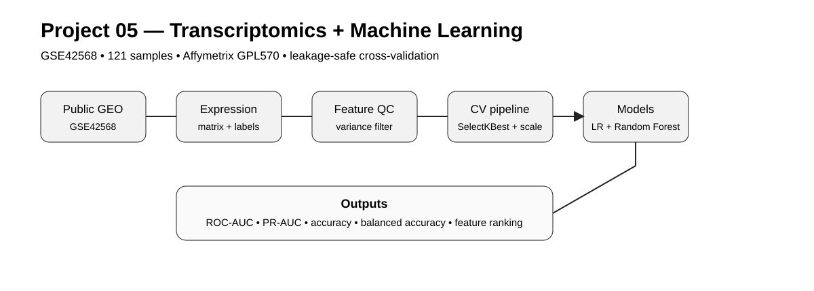
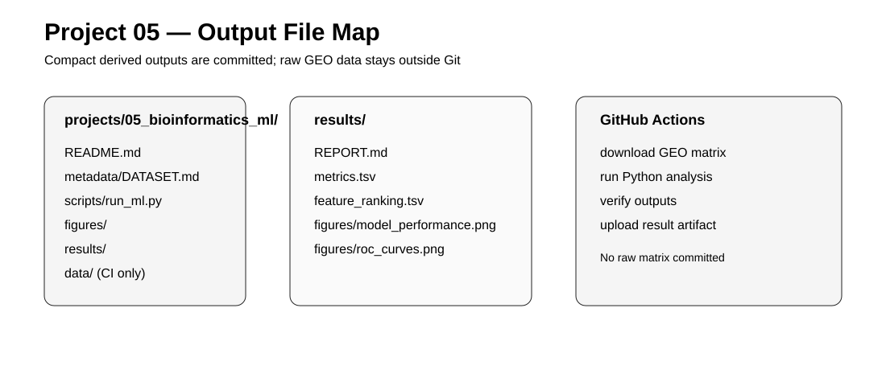
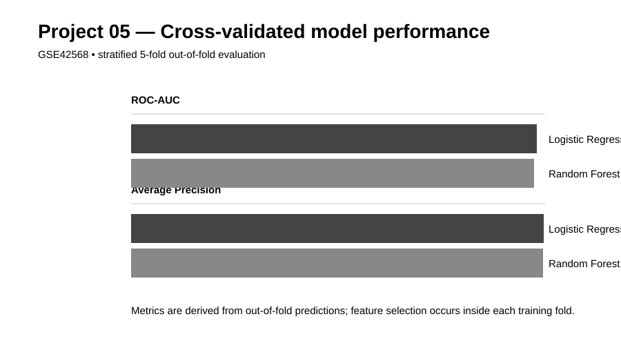

# Project 05 — Bioinformatics + Machine Learning

Machine-learning classification of breast cancer tissue from public transcriptomic data.

## Objective

Build a leakage-aware machine-learning workflow that uses public gene-expression data to distinguish **breast cancer tissue** from **normal breast tissue**.

The project demonstrates:

- GEO transcriptomics data retrieval
- expression-matrix parsing and metadata extraction
- feature filtering
- leakage-safe feature selection inside cross-validation
- Logistic Regression and Random Forest
- ROC-AUC, PR-AUC, accuracy and balanced accuracy
- model-derived feature ranking
- reproducible GitHub Actions execution

## Dataset

**NCBI GEO:** GSE42568 — *Breast Cancer Gene Expression Analysis*

- Organism: *Homo sapiens*
- Samples: 121 total
- Breast cancer: 104
- Normal breast tissue: 17
- Platform: GPL570, Affymetrix Human Genome U133 Plus 2.0 Array
- Experiment type: expression profiling by array
- Public since 2013

NCBI describes the dataset as gene-expression profiling of 104 breast cancer and 17 normal breast biopsies.

The analysis uses the processed series-matrix expression values rather than the 935.2 MB raw CEL archive. The GEO sample records state that the processed values are log2 GC-RMA signal intensities.

## Machine-learning design

The central rule is **no test-set leakage**.

For each stratified cross-validation training fold:

1. Remove features with zero variance.
2. Select the top 100 genes using ANOVA F-score.
3. Standardize selected features.
4. Fit the classifier.

The feature-selection step is therefore learned only from the training fold.

Two models are evaluated:

- Logistic Regression with L2 regularization
- Random Forest

Metrics:

- ROC-AUC
- Average Precision (PR-AUC)
- Accuracy
- Balanced Accuracy

The final feature ranking is generated separately after cross-validation and is explicitly treated as an exploratory model interpretation, not as an unbiased performance estimate.

## Workflow

GEO GSE42568  
↓  
Download processed series matrix  
↓  
Extract sample labels from GEO metadata  
↓  
Expression matrix QC  
↓  
Variance filtering  
↓  
Leakage-safe feature selection  
↓  
Logistic Regression + Random Forest  
↓  
Stratified 5-fold CV  
↓  
ROC/PR metrics + feature ranking  
↓  
Figures + reproducibility report

## Repository structure

```text
05_bioinformatics_ml/
├── README.md
├── metadata/
│   └── DATASET.md
├── scripts/
│   └── run_ml.py
├── figures/
│   ├── 01_workflow.svg
│   └── 02_output_file_map.svg
└── results/
    ├── REPORT.md
    ├── metrics.tsv
    ├── feature_ranking.tsv
    └── figures/
```

Raw GEO data and the downloaded matrix are not committed.

## Figures







## Verified run

GitHub Actions run #2 completed successfully.

- Samples: 121
- Normal: 17
- Breast cancer: 104
- Non-constant probes: 54,579
- Logistic Regression ROC-AUC: **0.9802**
- Logistic Regression Average Precision: **0.9964**
- Random Forest ROC-AUC: **0.9740**
- Random Forest Average Precision: **0.9953**

These metrics are from stratified 5-fold out-of-fold predictions with feature selection performed inside each training fold.

## Interpretation boundary

A high classification score would show that the expression profiles contain information that separates the two tissue classes in this dataset. It would **not** establish a clinical diagnostic test, causal biomarkers, or generalization to other cohorts.

External validation on an independent GEO cohort would be required before making claims about generalization.

## Reproducibility

The GitHub Actions workflow downloads the public GEO series matrix at run time, records the source accession, runs the exact analysis script, and uploads compact derived results as an artifact.

The project will only report numerical results after the workflow has actually completed successfully.
