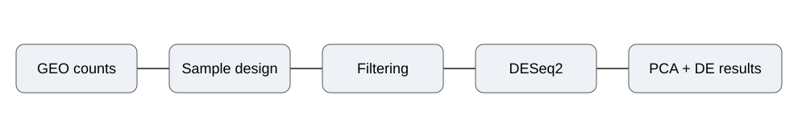
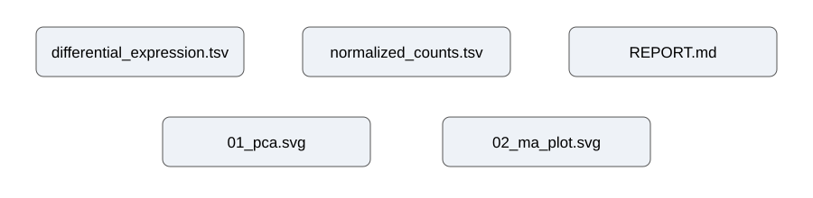

# Project 06 — RNA-seq Differential Expression

Differential-expression analysis of paired human CD4 T-cell bulk RNA-seq samples from oral mucosa and blood.

## What this project does

Use a public GEO count matrix to identify genes that differ between **oral mucosa and blood** while accounting for the matched subject design.

The project demonstrates:

- public GEO count-matrix processing
- paired sample design
- low-count filtering
- DESeq2 normalization and Wald testing
- multiple-testing correction
- PCA-based sample structure assessment
- differential-expression reporting
- reproducible analysis with R and Python metadata handling

## Dataset

**NCBI GEO:** GSE116139 — *A human TH17 population with a tissue-resident signature in healthy and inflamed oral mucosal tissues [Bulk RNA-seq]*

- Organism: *Homo sapiens*
- Platform: Illumina HiSeq 2500
- Input: processed bulk RNA-seq count matrix
- Analysis subset: matched CD69− samples
- Samples analyzed: 18
- Subjects: 9
- Comparison: oral mucosa vs blood

The full GEO series contains additional sample types and experimental components. This project deliberately uses the matched CD69− subset so that the comparison remains focused and paired.

## Analysis design

The analysis uses a subject-blocked design:

`~ subject + tissue`

This accounts for subject-to-subject variation while testing the tissue effect.

Significance is defined as:

- adjusted p-value < 0.05
- |log2 fold change| ≥ 1

Benjamini–Hochberg correction is used for multiple testing.

## Workflow



GEO count matrix  
↓  
Matched CD69− sample selection  
↓  
Subject/tissue metadata  
↓  
Low-count filtering  
↓  
DESeq2 normalization + Wald test  
↓  
PCA + differential-expression results  
↓  
Verified summary and output tables

## Results

The verified analysis summary contains:

- **18** matched samples
- **9** subjects
- **11,696** genes after low-count filtering
- **519** significant genes
- **294** significantly upregulated genes
- **225** significantly downregulated genes

| Result | Value |
|---|---:|
| Samples | 18 |
| Subjects | 9 |
| Genes after filtering | 11,696 |
| Significant genes | **519** |
| Upregulated | **294** |
| Downregulated | **225** |

[Verified results report](results/REPORT.md)  
[Metrics table](results/metrics.tsv)

## Output map



The workflow also generates the complete differential-expression table, normalized counts, PCA, volcano plot and sample/library mapping. These larger generated outputs are retained as workflow artifacts rather than committed to the repository.

## Repository structure

```text
06_rnaseq_differential_expression/
├── README.md
├── metadata/
│   └── DATASET.md
├── scripts/
│   ├── run_deseq2.R
│   └── resolve_library_map.py
├── figures/
│   ├── 01_workflow.svg
│   └── 02_output_file_map.svg
└── results/
    ├── REPORT.md
    └── metrics.tsv
```

## Limitations\n\nThis project analyzes only the selected CD69− paired subset, does not reproduce every comparison in the original study, and does not perform pathway enrichment or independent biological validation. The analysis uses a processed GEO count matrix rather than starting from raw FASTQ files.\n\n## Interpretation boundary

The results describe differential expression within this public research dataset. They are **not** presented as clinical biomarkers, diagnostic evidence, or proof of tissue-specific causality.

Independent cohorts and additional biological validation would be required before making claims about generalization or clinical relevance.

## Reproducibility

The analysis records the GEO accession, sample subset, paired statistical design, filtering threshold and analysis outputs. Large raw/generated files are kept outside the repository so the project remains lightweight and easy to inspect.

[Back to portfolio](../../)
